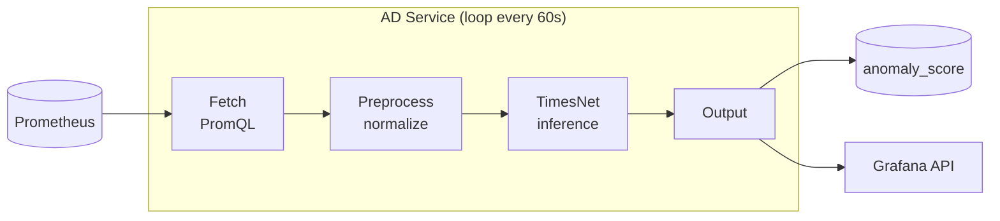

# Anomaly Detection Service

TimesNet-based anomaly detection for Prometheus metrics with Datadog-style Grafana visualization.

## Quick Start

```bash
# Install dependencies
make install

# Run with mock detector (no trained model needed)
make run

# Run tests
make test
```

## Architecture



## Configuration

All config via environment variables:

| Variable | Default | Description |
|----------|---------|-------------|
| `PROMETHEUS_URL` | `http://localhost:9090` | Prometheus/Gigapipe URL |
| `PROMETHEUS_QUERY` | `up` | PromQL query for metrics |
| `FETCH_INTERVAL_SECONDS` | `60` | Seconds between cycles |
| `MODEL_PATH` | `models/timesnet.pt` | Path to trained model |
| `ANOMALY_THRESHOLD` | `0.75` | Score above this = anomaly |
| `GRAFANA_URL` | - | Grafana URL for annotations |
| `GRAFANA_API_TOKEN` | - | Grafana service account token |
| `LOG_LEVEL` | `INFO` | Logging level |
| `LOG_FORMAT` | `json` | `json` or `console` |

## Development

```bash
# Format code
make fmt

# Lint
make lint

# Test with coverage
make test-cov
```

## Docker

```bash
# Build and run with local Prometheus
docker-compose up --build

# Health check
curl http://localhost:8080/health
```

## Documentation

See [docs/](./docs/) for:
- [Project Plan](./docs/PLAN.md)
- [Task Breakdowns](./docs/tasks/)
