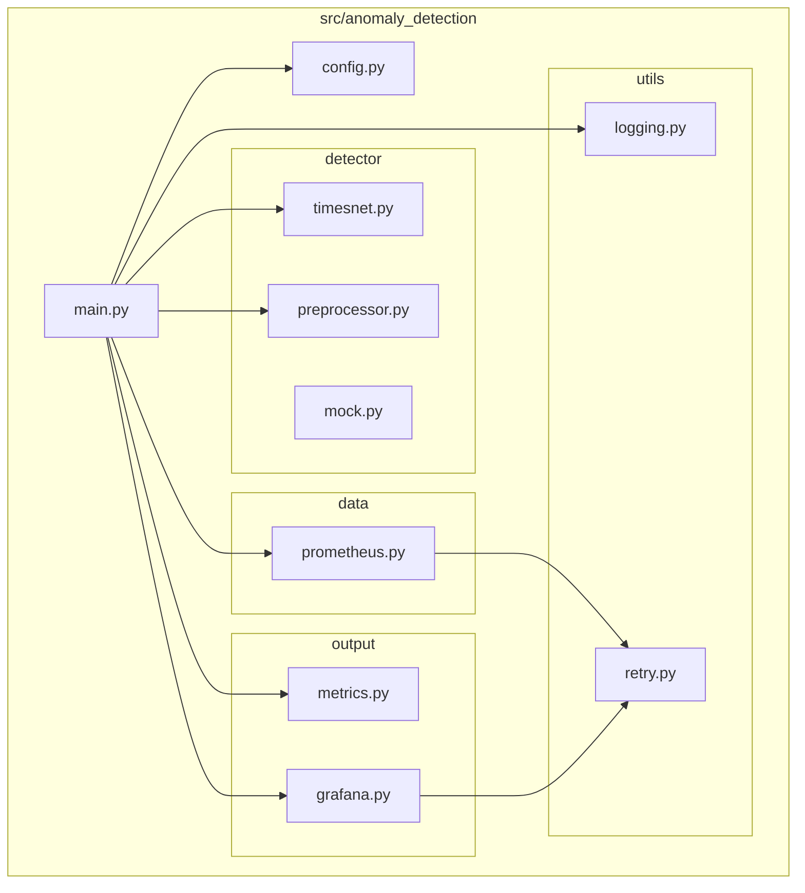
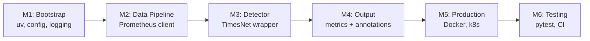
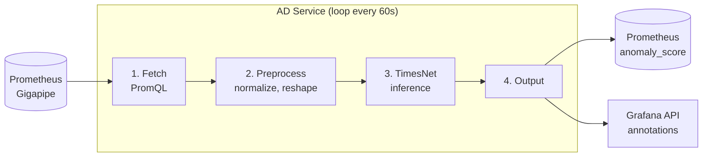

# Anomaly Detection Service — Implementation Plan

## Overview

Build a production-grade Python service that:
1. Fetches metrics from Prometheus/Gigapipe
2. Runs TimesNet inference to detect anomalies
3. Pushes `anomaly_score` metric to Prometheus
4. Writes Grafana annotations for Datadog-style shaded regions

## Tech Stack

| Component | Choice | Why |
|-----------|--------|-----|
| Package manager | `uv` | Fast, lockfile, replaces pip+venv |
| Python | 3.11+ | Match production, type hints |
| ML runtime | PyTorch or ONNX | TimesNet weights |
| HTTP client | `httpx` | Async, modern |
| Config | `pydantic-settings` | Type-safe env vars |
| Logging | `structlog` | JSON logs for k8s |
| Metrics | `prometheus-client` | Push gateway compatible |
| Testing | `pytest` | Standard |
| Linting | `ruff` + `mypy` | Fast, strict |

## Component Diagram



## Project Structure

```
anomaly-detection/
├── pyproject.toml              # dependencies + metadata
├── uv.lock                     # locked deps (auto-generated)
├── .python-version             # 3.11
├── Dockerfile
├── docker-compose.yml
├── Makefile
├── README.md
│
├── src/
│   └── anomaly_detection/
│       ├── __init__.py
│       ├── main.py             # entrypoint
│       ├── config.py           # Settings class
│       │
│       ├── detector/
│       │   ├── __init__.py
│       │   ├── timesnet.py     # model wrapper
│       │   └── preprocessor.py # normalize, reshape
│       │
│       ├── data/
│       │   ├── __init__.py
│       │   └── prometheus.py   # PromQL client
│       │
│       ├── output/
│       │   ├── __init__.py
│       │   ├── metrics.py      # anomaly_score gauge
│       │   └── grafana.py      # AnomalyAnnotator
│       │
│       └── utils/
│           ├── __init__.py
│           └── logging.py
│
├── tests/
│   ├── conftest.py
│   ├── test_detector.py
│   ├── test_prometheus.py
│   └── test_grafana.py
│
├── models/                     # .pt or .onnx files
│   └── .gitkeep
│
├── scripts/
│   ├── train.py                # training (uses Time-Series-Library)
│   └── export_onnx.py
│
└── docs/
    ├── PLAN.md                 # this file
    └── tasks/
        └── *.md                # task breakdowns
```

## Milestones



### M1: Project Bootstrap
Set up uv, project structure, config, logging. No ML yet.

### M2: Data Pipeline
Fetch metrics from Prometheus/Gigapipe, format for TimesNet input.

### M3: Detector Integration
Load TimesNet model, run inference, get anomaly scores.

### M4: Output Pipeline
Push scores to Prometheus, write Grafana annotations.

### M5: Production Hardening
Dockerfile, health checks, graceful shutdown, error handling.

### M6: Testing & CI
Unit tests, integration tests, GitHub Actions.

---

## Main Loop (Target Architecture)



## Config (Environment Variables)

```bash
# Data source
PROMETHEUS_URL=http://prometheus:9090
PROMETHEUS_QUERY='rate(http_requests_total[5m])'
FETCH_INTERVAL_SECONDS=60

# Model
MODEL_PATH=/app/models/timesnet.pt
WINDOW_SIZE=96
ANOMALY_THRESHOLD=0.75

# Output
PUSHGATEWAY_URL=http://pushgateway:9091
GRAFANA_URL=https://grafana.company.com
GRAFANA_API_TOKEN=glsa_xxx
GRAFANA_DASHBOARD_UID=anomaly-detection

# Logging
LOG_LEVEL=INFO
LOG_FORMAT=json
```

## Links

- [Task Breakdown](./tasks/)
