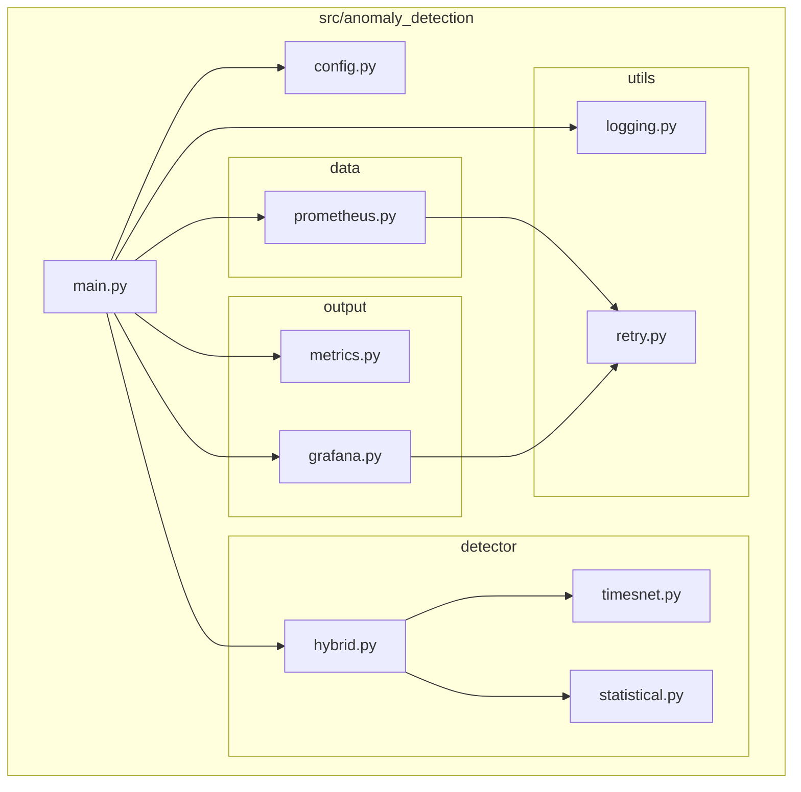
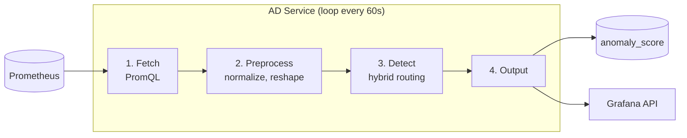
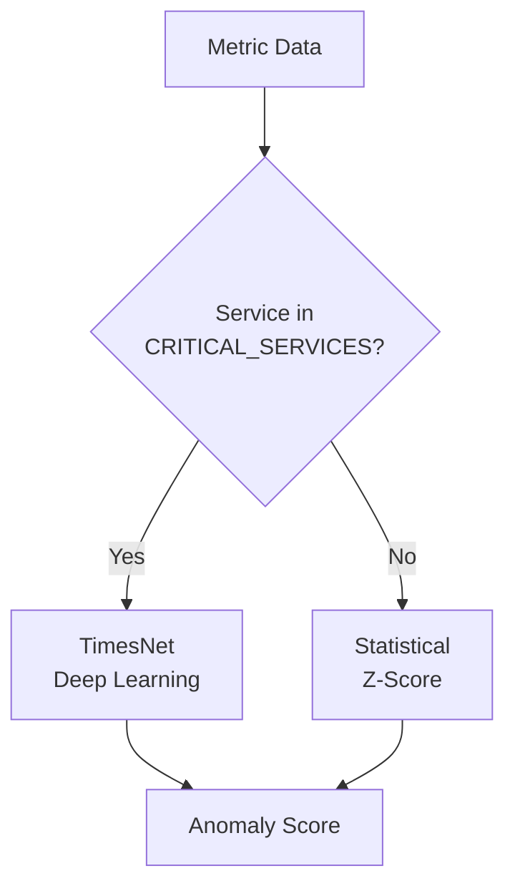

# Anomaly Detection Service — Documentation

## Overview

This service detects anomalies in Prometheus metrics using a hybrid approach:
- **TimesNet** (deep learning) for critical services
- **Statistical methods** (Z-score) for the long tail of services

## Architecture



## Main Loop



## Hybrid Detection Flow



## Documents

| Document | Description |
|----------|-------------|
| [BACKLOG.md](./BACKLOG.md) | Unfinished work and future improvements |

## Tech Stack

| Component | Choice | Why |
|-----------|--------|-----|
| Package manager | `uv` | Fast, lockfile, replaces pip+venv |
| Python | 3.11+ | Match production, type hints |
| ML runtime | PyTorch | TimesNet weights |
| HTTP client | `httpx` | Async, modern |
| Config | `pydantic-settings` | Type-safe env vars |
| Logging | `structlog` | JSON logs for k8s |
| Metrics | `prometheus-client` | Push gateway compatible |
| Testing | `pytest` | Standard, 100% coverage |
| Linting | `ruff` + `mypy` | Fast, strict |

## Project Structure

```
anomaly-detection/
├── pyproject.toml              # dependencies + metadata
├── uv.lock                     # locked deps
├── Dockerfile
├── docker-compose.yml
├── Makefile
│
├── src/anomaly_detection/
│   ├── main.py                 # entrypoint
│   ├── config.py               # Settings class
│   ├── detector/               # anomaly detection
│   │   ├── hybrid.py           # routes to timesnet/statistical
│   │   ├── timesnet.py         # deep learning model
│   │   ├── statistical.py      # z-score based
│   │   └── rolling.py          # ema-based
│   ├── data/prometheus.py      # PromQL client
│   ├── output/
│   │   ├── metrics.py          # anomaly_score gauge
│   │   └── grafana.py          # annotations
│   └── utils/
│       ├── logging.py
│       └── retry.py
│
├── tests/                      # 100% coverage
├── models/                     # .pt files
├── scripts/download_model.py
└── docs/
```
